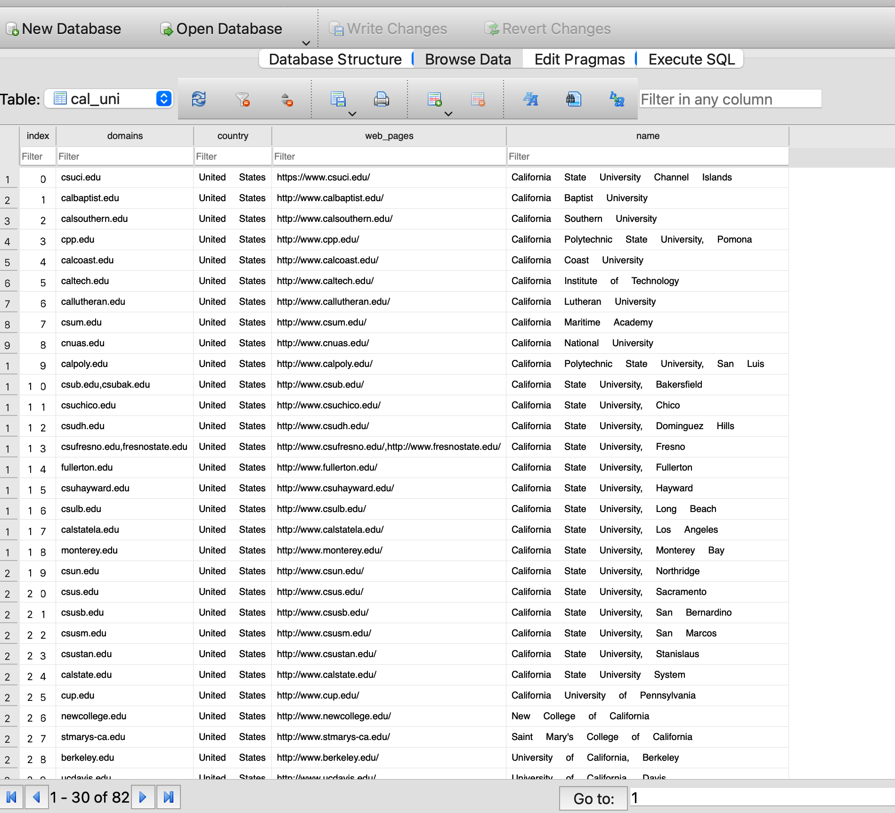

# Description
This Python script serves as an example of an ETL (Extract, Transform, Load) pipeline. It demonstrates how to extract data from a specified API, transform the data to filter for universities in California, and load the transformed data into an SQLite database.

# How to Run
To use this script, make sure you have the required Python libraries installed (requests, pandas, sqlalchemy). Then, run the script to initiate the ETL pipeline and load the university data into the SQLite database.
# Install dependencies

#### `brew install requests`
#### `brew install pandas`
#### `pip install sqlalchemy`

# how to run locally

`python3 etl.py`

# Usage

Extract: The extract function retrieves university data from a designated API.

Transform: The transform function processes the extracted data, filtering for universities in California and reorganizing it for further analysis.

Load: The load function loads the transformed data into an SQLite database.

# Verify its working fine or not

Console message :

In db in will look like below :

