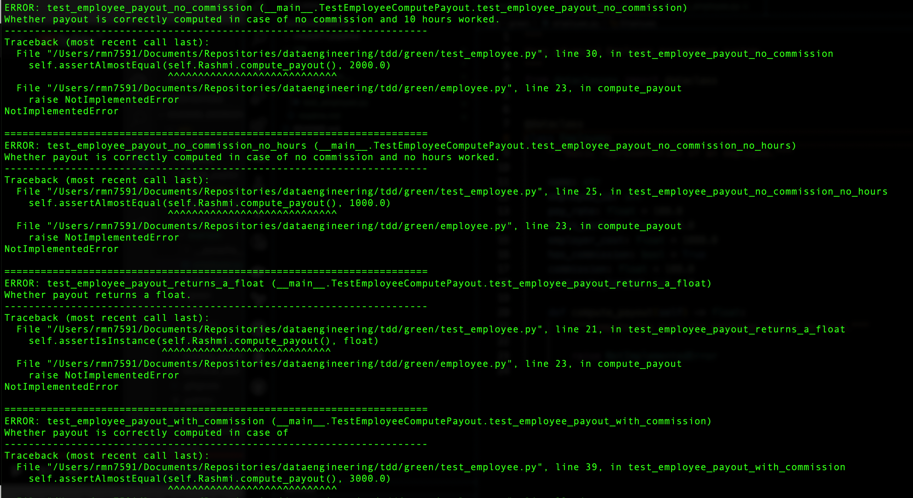

# TDD
Test-driven development (TDD), also known as red-green-refactor is a common software development technique in which you write tests before you write the actual code

## Steps needs to follow :

#### Step 1: You write tests
#### Step 2: Run those tests and make sure those fail
#### Step 3: Write simplest code
#### Step 4: Make sure all tests pass including any other previous test
#### Step 5: Refactor the code

## Screenshots taken while performing :

#### After writing tests

#### After running tests which failed

#### After it got passed

# Pros and cons of TDD

#### Pros
- It forces developers to think about the requirements first
- Even if it is going to take time for you to write code, it would be efficient ,because you can detect bugs earlier
- If you start by writing tests first which means its easy to separate from other part of applications
- Writing and mainting tests would be consuming. Debugging can be faster

Cons:
- If you have written so many tests, false sense of security is there
- if you are working in a start up adding those tests might become a overhead because your product might change and it might be waste of your time, so careful balance needed
- You might blind spots

#### Some more tips:
- Try using same data in multiple tests
- Don't write depedent test
- Try to test the failed test and fixed test
